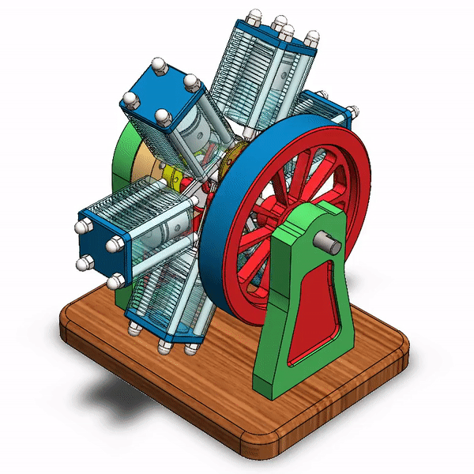

# Six Cylinder Radial Engine
### To view the assembly, download the folder and open Full_Assembly.SLDASM with Solidworks.

This engine Solidworks assembly illustrates my ability to design, prototype, and simulate a product. The project demonstrates skills in design intent, sketch & extrude tools, and integrating physical parameters in a simulation.
